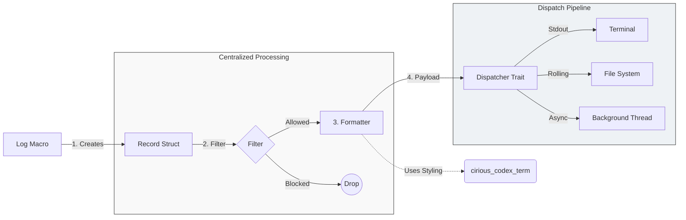

<div align="center">

# 📜 Cirious Codex Logger

### Structured Logging & Event Tracing for the Cirious Ecosystem

Robust, extensible, and performance-oriented observability primitives designed for modern Rust applications.

[](https://github.com/cirious-studio/cirious_codex_logger/actions/workflows/ci.yml) [](https://crates.io/crates/cirious_codex_logger) [](https://docs.rs/cirious_codex_logger) [](https://www.rust-lang.org/) [](#-license)

</div>

---

## 📖 Overview

**Cirious Codex Logger** is the observability foundation of the Cirious ecosystem.

Built with performance, flexibility, and maintainability in mind, it provides structured logging, event tracing, metadata enrichment, and configurable dispatch pipelines for applications ranging from command-line tools to large-scale services.

Rather than being a simple logger, Codex Logger acts as a centralized event processing layer capable of capturing, formatting, filtering, and routing runtime information with minimal overhead.

### Core Principles

* ⚡ Performance First
* 🧩 Fully Modular Architecture
* 📊 Structured Event Processing
* 🎨 Rich Terminal Experience
* 🔍 Production-Ready Observability
* 🦀 Native Rust Ergonomics

---

## ✨ Features

### Structured Logging

Powerful logging macros with compile-time ergonomics:

```rust
trace!();
debug!();
info!();
warn!();
error!();
```

## 📂 Examples

Explore practical examples in the `examples/` directory.

| Example                | Description                   |
| ---------------------- | ----------------------------- |
| [`basic_logging.rs`](examples/basic_logging.rs)     | Basic logger setup            |
| [`async_logging.rs`](examples/async_logging.rs)     | Non-blocking event processing |
| [`rolling_file.rs`](examples/rolling_file.rs)      | Automatic file rotation       |

---

## Metadata Enrichment

Every event can carry contextual information such as:

* Timestamp
* Log level
* Module path
* Source file
* Line number
* Thread information

### Flexible Dispatch System

Route events to multiple destinations:

* Standard Output
* Standard Error
* Rolling Files
* Custom Dispatchers

### Async Processing

Background-thread dispatching for reduced runtime impact.

### Advanced Formatting

Choose between:

* Human-readable terminal output
* Structured JSON logs
* Custom formatters

### Intelligent Filtering

Filter events by:

* Log level
* Module path
* Custom rules

---

### Architectural Overview


---

## 🚀 Quick Start

Add the crate to your project:

```toml
[dependencies]
cirious_codex_logger = "0.2"
```

Initialize a dispatcher and start logging:

```rust
use cirious_codex_logger::{
    init,
    info,
    StdoutDispatcher,
    StyledTerminalFormatter,
};

fn main() {
    let formatter = StyledTerminalFormatter;

    let dispatcher =
        Box::new(StdoutDispatcher::new(formatter));

    init(dispatcher)
        .expect("Failed to initialize logger");

    info!("Cirious Codex Logger initialized.");
    info!("Status: {}, Users: {}", "Online", 128);
}
```

---

## 🚧 Development Roadmap

### ✅ v0.1.0 — Foundation

- [x] Core logging macros
- [x] Terminal formatter
- [x] JSON formatter
- [x] Stdout / Stderr dispatchers
- [x] Initial Cirious Term integration

### ✅ v0.2.0 — Production Readiness

- [x] Global logger registration
- [x] Metadata enrichment
- [x] Log filtering
- [x] Async dispatching
- [x] Rolling file support
- [x] Improved formatter API

### 🔭 v0.3.0 — Observability & Diagnostics

- [ ] Structured Fields (estilo tracing) → enorme ganho de valor.
- [ ] MultiDispatcher → muito solicitado em produção.
- [ ] Runtime Filter Reloading → excelente para debug.
- [ ] Scoped Context → diferencial profissional.
- [ ] Panic Capture → praticamente obrigatório para observabilidade.

## 📜 License

Licensed under either of the following, at your option:

* MIT License
* Apache License 2.0

---

<div align="center">

<i>Minimalist by design. Consistent in execution.</i>

**Engineered by Cirious Studio**

</div>
